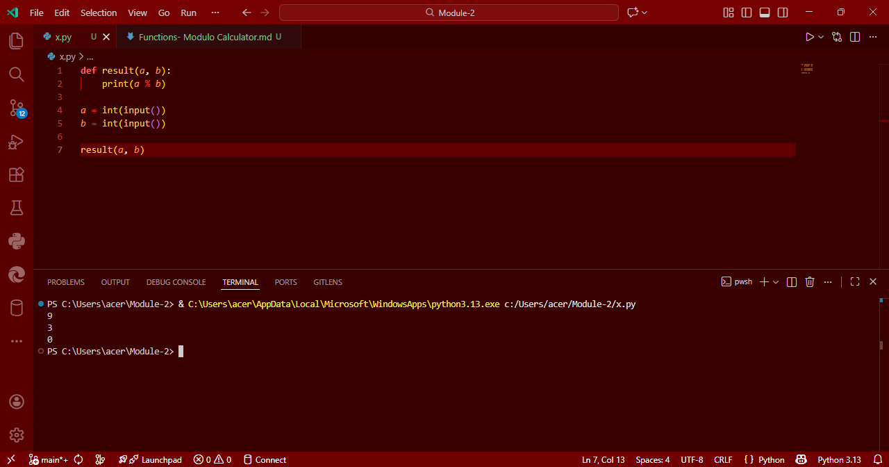

# Functions in Python: Modulo Calculator

## Aim
To write a Python program that defines a function which accepts two values and returns their **modulo** using the `%` operator.

## Algorithm
1. Define a function called `result` that takes two arguments `a` and `b`.
2. Inside the function, compute the modulo using `a % b`.
3. Print the result of the modulo operation.
4. Get two integer inputs from the user.
5. Call the `result` function with the user-provided values.

## Program
```

```

## Output


## Result
Thus, the Python program to calculate the modulo of two numbers using a function is executed successfully.