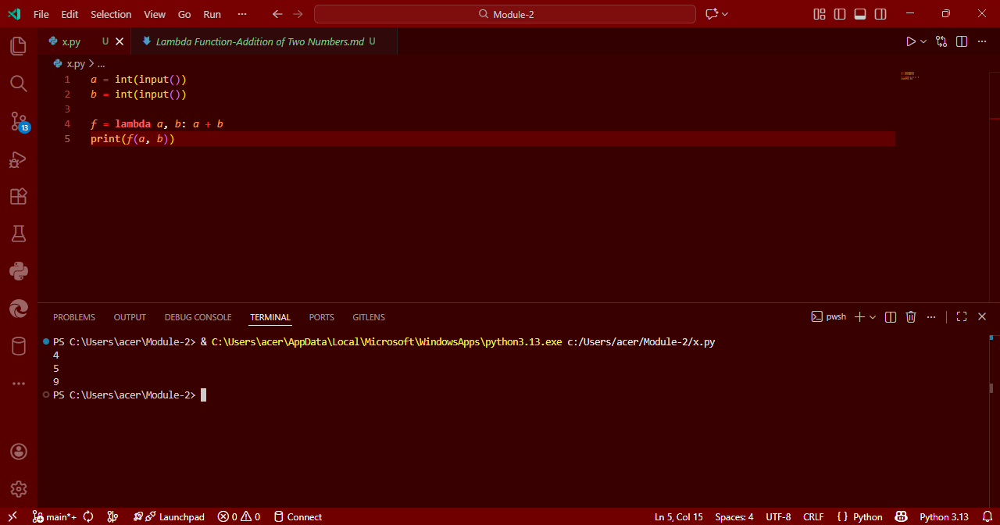

# Lambda Function in Python: Addition of Two Numbers

## Aim
To write a Python program that defines a **lambda function** which takes two arguments `a` and `b`, and returns their sum.

## Algorithm
1. Get two integer inputs from the user.
2. Use a **lambda function** to define a function `f` that returns `a + b`.
3. Call the function with the user inputs and print the result.

## Program
```
a = int(input())
b = int(input())

f = lambda a, b: a + b
print(f(a, b))
```
## Output


## Result
Thus, the Python program using a lambda function to add two numbers is executed successfully.