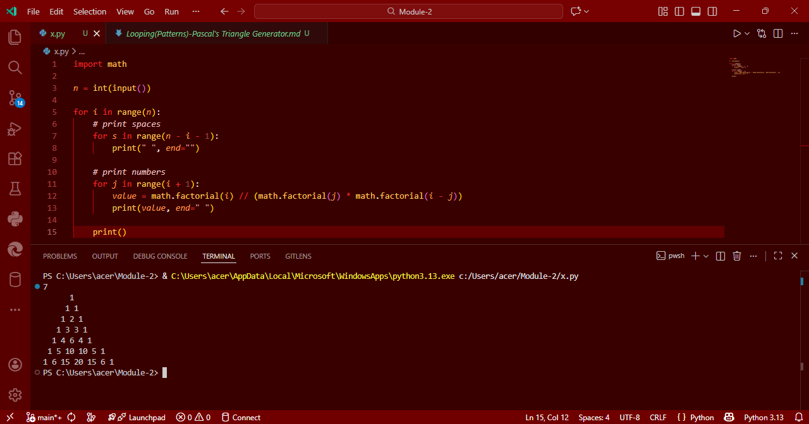

# 🔺 Looping(Patterns)-Pascal's Triangle Generator in Python

This project demonstrates a simple Python program to generate **Pascal’s Triangle**, where the number of rows is provided by the user.

---

## 🎯 Aim

To write a Python program that generates **Pascal's Triangle** using numbers. The number of rows is accepted from the user.

---

## 🧠 Algorithm

1. Start the program.
2. Input the number of rows from the user.
3. Loop from 0 to the number of rows.
4. For each row:
   - Print appropriate spaces to shape the triangle.
   - Compute values using the formula:  
     \[
     C(n, k) = \frac{n!}{k!(n-k)!}
     \]
5. Print all rows of Pascal’s Triangle.
6. End the program.

---

## 🧪 Program
```
import math

n = int(input())

for i in range(n):
    # print spaces
    for s in range(n - i - 1):
        print(" ", end="")

    # print numbers
    for j in range(i + 1):
        value = math.factorial(i) // (math.factorial(j) * math.factorial(i - j))
        print(value, end=" ")

    print()
```

## Sample Output


## Result
Thus, the Python program to generate Pascal’s Triangle using loops and factorials is executed successfully.
